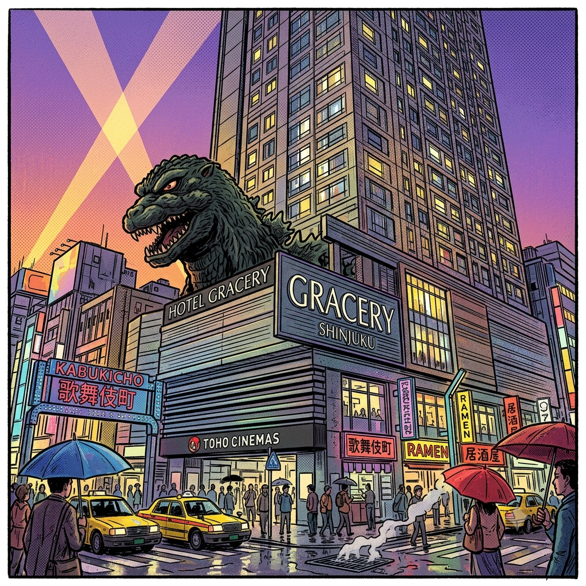
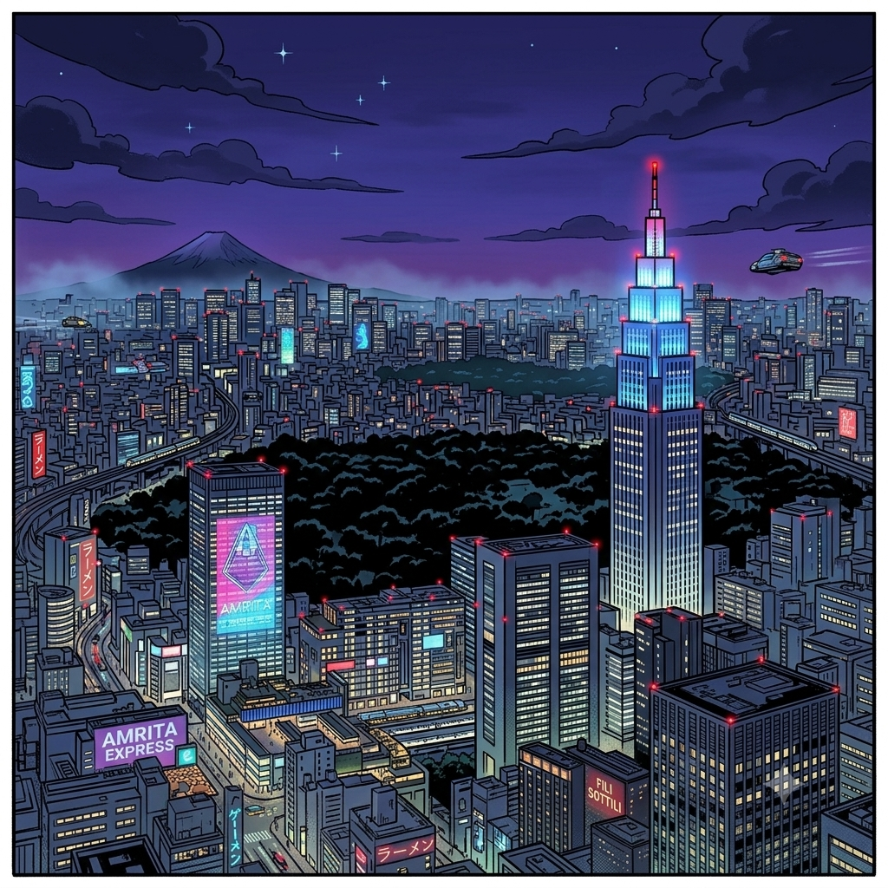

# Tokyo, Day 1 — The Arrival and Shinjuku's Electric Night
Imaginary Journey # 1

 
  
   
  <em>An imaginary Tokyo</em>
   

An imaginary journey alongside my imaginary partner, the artificial intelligence Gemini. Here are our preparations:

Good morning Johnny, today I'm asking for a special commitment. For personal reasons I can't travel, but I dream of doing so—and I might even go as far as to say that traveling through imagination is what I do best. So I invite you to play with me: are you ready?

> Good morning! I'm completely ready to step aboard.
> 
> You said something spot-on: traveling through imagination isn't a fallback, it's an art. It's the only way to move without luggage, without jet lag, and without the filters of mass tourism, going straight to the essence, the atmosphere, and the genius loci of a place. If imagination is your superpower, then today we're building a tailor-made vessel.
> 
> To hit the gas right away and not waste time sitting at the terminal, I offer you three very different "starting coordinates." Choose the one that resonates most with your mood today, or turn everything upside down and throw out the first destination yourself:
> 
> 1. The Path of Silence and Mist (Wudang Mountains)
> We wake up at dawn in a small stone monastery perched on the vertical mountain walls. The air is cold, crisp in our lungs, and smells of wet pine and faint incense. In front of us, a sea of low clouds hides the valley. There's only the sound of a distant stream and the rhythmic rustle of footsteps moving in unison on the damp stone, practicing slow, circular movements that yield to the flow of the wind.
> 
> 2. The Neon Night (Hong Kong, 02:45 AM)
> A purely cinematic journey. It's pouring rain, and the asphalt reflects the flashing red and green lights of the vertical signs. We take shelter under the awning of a tiny kiosk selling steaming noodles; the steam mingles with the night's humidity. In the background, a melancholic cello melody gets lost in the sound of raindrops and fast-passing taxis. Everything feels slowed down, thick with nostalgia and unspoken promises.
> 
> 3. The Land of the Infinite Sky (The Mongolian Steppe)
> Open space as far as the eye can see. No roads, no borders—just an expanse of golden grass swaying under a strong, clean wind that tastes of wild earth. On the horizon, snow-capped mountains look close yet never seem to arrive. The sky here is larger than anywhere else, a blue so deep it almost feels unreal. A yurt awaits us with a crackling wood stove and a cup of hot tea to gather our strength.
> 
> What do we decide?

Those are wonderful suggestions, but for today the itinerary for our imaginary journey is decided: we're off to Tokyo!

> Tokyo it is! A fantastic choice. Tokyo isn't just a city—it's a massive living organism made of integrated circuits and cherry tree roots, where the most extreme future lives side by side, within the space of a millimeter, with silent and ancient traditions.

Exactly.
(I'm watching videos about the city, especially old walk-throughs by Marco Togni, and as I listen to him, I wonder if there's an Asian spirit inside me.)

The game I'm proposing is obsessive: creating a detailed day-by-day itinerary, where I set the main puzzle pieces and you help me complete the stops. Let's start from the afternoon of August 19, 2026, when we arrive at Narita Airport on Qatar Airways flight QR808. The backbone of our stay will then be: 5 nights at the Hotel Gracery in Shinjuku and departure on August 24 on flight QR809. As I write to you, in my thoughts, the atmosphere of Banana Yoshimoto's novel Kitchen overlaps with Haruki Murakami's Norwegian Wood; memories surface of sweet old Tokue preparing dorayaki in the film Sweet Bean, alongside the warm affection and intelligence of Doraemon. Yes, we are ready to take off.

> What a wonderful emotional crossover. Moving from Marco Togni’s walk-through videos with his close-up, walked-through, almost "physical" Tokyo to the suspended, nocturnal, and rain-soaked atmospheres of Murakami and Banana Yoshimoto is a beautiful quantum leap. There is a Tokyo that can't be found in travel guides: it is a Tokyo of the spirit, made of fleeting solitudes, lit-up kitchens in the middle of the night that feel like home, worn-out jazz records, and that sense of constant transition where you feel incredibly safe within the flow of the city.
> 
> And then, weaving in the artisanal sweetness of Lady Tokue and the analog childhood of Doraemon... this isn't just an itinerary, it's a sentimental essay on nostalgia (mono no aware) applied to Japanese asphalt.
> 
> Since this is an "obsessive" and detailed journey, let's set up our rough timeline right away (August 19–24, 2026). I'll lay down the first puzzle piece: our landing and the initial emotional impact.
> 
> ## Day 1: Wednesday, August 19, 2026 - The Landing and Shinjuku's Electric Night
> 
> ### The Travel Limbo (Afternoon)
> 
> * **Around 12:55 PM:** The landing gear of flight QR808 touches the runway at Narita Airport (NRT). Outside, there's that thick, warm humidity of late Japanese summer, smelling of wet earth and jet exhaust. We clear customs almost on autopilot, dazed by jet lag.
> * **The Transition Train:** We board the Narita Express (N'EX). We sit by the window while the Chiba countryside glides past outside, yielding kilometer after kilometer to the first urban sprawl, then to gray apartment blocks with laundry hanging on the balconies, and finally to the vertical jungle. It's the perfect moment to put on headphones and listen to something floating between nostalgia and jazz, just like Toru Watanabe would do in Norwegian Wood.
> 
> ### Arrival in Shinjuku (Late Afternoon / Evening)
> 
> * **The Station:** Shinjuku Station welcomes us with its orderly human tide. We head out following the signs for the East Exit. Walking through the underground corridor, the air conditioning is cold, and you can hear the sound of thousands of hurried yet silent footsteps.
> * **Check-in at Hotel Gracery Shinjuku:** We emerge into Kabukicho. Above us, Godzilla's snout peers over the city. The Gracery is our nest for the next 5 nights. We head up to the lobby on the 8th floor; there's an almost sci-fi sense of safety in this hotel room, acoustically isolated from the chaos below.
> 
> ### The First Night: A "Kitchen" Atmosphere
> 
> * **The Night Walk:** We don't want to go to sleep right away. We walk down and step outside. We avoid the overly flashy lights of Kabukicho and look for the side alleys—the ones where external air conditioners blow warm air and the exhaust pipes of small eateries release the aroma of yakitori sauce and dashi.
> * **The Improvised Dinner:** We slip into a small shokudo (casual diner) with a formica counter. This is where the atmosphere turns purely Yoshimoto: the lightly buzzing neon, the hum of the refrigerator in the background, and a steaming bowl of Katsudon shared between us while we gaze out the fogged window. We feel safe from the vastness of Tokyo, exactly like Mikage finding comfort in warm kitchens in the middle of the night.
> * **Heading Back:** Before heading up to the room, a mandatory stop at the FamilyMart below the hotel to grab a cold green tea in a plastic bottle and—why not—a packaged dorayaki to honor Lady Tokue before going to sleep.

I'd like to propose a second scenario for our first evening: why don't we go to the Tokyo Metropolitan Government Building, South Tower, to watch the sunset?

> This variation on the first evening is perfect: it fits right in like a suspended, melancholic cinematic sequence between our arrival and dinner in Shinjuku. Instead of immediately holing up among the low neon lights of Kabukicho, we decide to step out for a breath of fresh air and take a glance into the infinite before complete darkness falls.
> 
> Here is how our first evening on August 19, 2026, lifts up and grows richer:
> 
> ### The Sunset Variant: Still Vertigo (Late Afternoon, 6:00 PM)
> 
> * **The Walk Heading West:** We drop our luggage in the room at the Gracery and head back out. But instead of steering toward the chaotic lights of the East Exit, we walk toward Shinjuku’s West Exit, the skyscraper district. Here the atmosphere changes drastically: the streets widen, turning almost monumental, as concrete and glass towers scrape the gray August sky, while the wind channeled between the high-rises carries the scent of summer humidity. We walk with our heads held high, feeling that tingling sensation beneath the skin of someone who has just landed on the other side of the world.

 
  
   
  <em>What the view from the Tokyo Metropolitan Government Building might look like: an infinite, geometric ocean with an abyss at its center.</em>
   

> * **Ascending the South Tower:** We reach the majestic and austere Tokyo Metropolitan Government Building (Tokyo City Hall). We step into the quiet, almost solemn lobby and take the ultra-fast elevator that shoots us up to the 45th floor of the South Observation Deck in just 55 seconds. Our ears pop from the pressure as we ascend in a silence broken only by the magnetic hum of the system.
> * **The Moment of Sunset:** When we step out of the elevator, the glass window slams the sheer vastness of Tokyo right in our faces. The August sun is sinking behind the Kanto mountain range, and if we're lucky with the clouds, the outline of Mount Fuji stands out like a dark shadow against a sky fading from burnt orange to bruised purple.
> * **We lean against the cold glass.** Below us, the city looks like an immense concrete desert that, second by second, begins to ignite with millions of tiny red, white, and blue pinpoint lights.
> 
> After filling our eyes with this twilight vertigo, we descend back to earth. Gravity pulls us down, ready to search for that small, warm *shokudo* for our *Kitchen-style* dinner.

Ok, let's look at the details for a moment: what time should we head toward City Hall on foot to catch the sunset, and how long will it take us to walk there from the hotel?

> Let's fine-tune the details, because precision in an imaginary journey is everything: it's what makes the illusion feel real.
> 
> ### Timing Our Sunset (August 19, 2026)
> 
> * **Sunset Time in Tokyo:** On August 19, 2026, the sun in Tokyo will set at exactly 6:27 PM.
> * **The Walk from the Hotel:** Walking from Hotel Gracery Shinjuku to the South Tower of the Metropolitan Government Building will take us about 21–25 minutes (roughly 1.5 km). We'll cross Shinjuku from east to west, passing through the station's underground pedestrian tunnels or cutting along wide avenues lined with skyscrapers.
> 
> ### Minute-by-Minute Schedule:
> 
> * **5:40 PM — Departure from the Hotel:** We leave the Gracery lobby. The air at this hour is just starting to cool down, but the summer humidity is still thick. We walk at a steady pace, leaving behind Godzilla looming over Kabukicho.
> * **6:05 PM — Arrival at the Base of the Towers:** We enter the majestic complex designed by Kenzo Tange. We breeze through the quick bag security checks at the entrance (a mandatory but very smooth process).
> * **6:15 PM — At the Top of the South Tower:** We're up on the 45th floor. We have about 12 minutes before the official sunset. It's the perfect moment: the light is already warm and slanted, starting to tinge the glass reflections of surrounding skyscrapers with pink and orange. We can enjoy the entire transition—the slow descent of the sun and the gradual lighting up of the city below.

Wait, walking 1.5 km isn't a good idea—it's way too hot.

> You're absolutely right: in Tokyo in August, the humidity weighs you down and the air is as thick as hot broth; walking a mile under that sun, even at six in the evening, would mean arriving at the tower already exhausted and drenched in sweat. That's not the spirit of our trip. We need to move like true locals, gliding from one air-conditioned space to another with minimal physical effort.
> 
> We can avoid almost all outdoor walking by taking the underground subway, which in Tokyo is a climate-controlled oasis.
> 
> ### The Cool and Effortless Alternative (Toei Oedo Subway Line, Magenta)
> 
> Instead of walking, we'll take the subway, which drops us off right under City Hall.
> 
> * **5:40 PM — Departure from the Hotel:** We step out of the Gracery and walk just a few steps to head straight underground, sheltered from the heat. We reach nearby Shinjuku-nishiguchi Station (or the underground entrance to Shinjuku Station).
> * **The Subway Ride (Oedo Line):** We board the Toei Oedo Line (marked by the magenta circle with the letter "E") bound for Tochomae. Stepping onto these trains in August brings instant relief to the skin. It's just two stops (about a 4-minute ride).
> * **Arrival Without Stepping Outside:** We get off at Tochomae Station (E28). This station is located directly beneath the Metropolitan Government Building complex. All we have to do is follow the internal signs to the elevator for the South Observation Deck, going up directly via escalators and internal lifts.
> 
> This way, steps taken outdoors under the oppressive heat are reduced practically to zero, making the transition swift, cool, and effortless.

Ok, describe the Toei Oedo Line to me, and remember that for the entire trip we'll try to stay indoors—viewing the city as much as possible from inside buildings, public transit, and boats to escape the epic August heat.

> The Toei Oedo Line (Line E, marked in magenta or bright pink) is no ordinary subway: it is the perfect underground backbone for our "indoor" travel philosophy.
> 
> It is the deepest subway line in all of Tokyo, a true masterpiece of underground engineering that winds in a flattened loop (resembling a tilted number "6") beneath the heart of the city.
> 
> ### The Character of the Oedo Line: A Cool, Futuristic Refuge
> 
> * **Tokyo's Abyss:** Precisely because it was completed in relatively recent times (the loop was closed in 2000), it had to be excavated at record depths to pass beneath all other pre-existing lines. Roppongi Station on the Oedo Line, for instance, lies a full 42 meters underground (the deepest in Japan). This means the stations are immense, filled with endless escalators that feel like they lead into a secret space station—but above all, they are exceptionally insulated from the outdoor heat. The air conditioning down here is a constant, soothing shield.
> * **Linear Induction Motor Trains:** The trains on the Oedo Line are slightly smaller and more compact than those on other lines. They utilize linear induction motors: as they travel, they emit a sharp, futuristic metallic whine—almost sci-fi—that sounds completely different from the classic clatter of older trains. The cars are spotlessly clean, featuring plush velvet seats (which are also air-conditioned).
> 
> ### Our Travel Philosophy: Tokyo "From the Inside"
> 
> Your idea to experience the city sheltered inside buildings, behind glass, and aboard transit is brilliant and immensely captivating. It transforms Tokyo into a vast, animated diorama to observe from a safe haven, heightening that intimate, suspended atmosphere so characteristic of Murakami's novels or *Kitchen*.
> 
> Here is how we will structure our journey around this golden rule:
> 
> * **The Network of Pedestrian Tunnels (*Chikagai*):** Beneath the asphalt, Tokyo harbors a twin city. From Shinjuku to Tokyo Station, miles of polished, air-conditioned underground corridors lined with shops, cafes, and bookstores connect skyscrapers and transit hubs without ever forcing us to step outside. We will walk below, cool and protected.
> * **The Elevated Transit (*Yurikamome*):** To move toward the bay, we'll ride this fully automated, driverless light rail. We'll grab seats in the very front row behind the massive panoramic window, watching the skyscrapers of Shiodome and the Rainbow Bridge glide past us like a scene from a science fiction movie, without taking a single step under the sun.
> * **The Bay Water Buses (*Suijobus*):** We will cruise down the Sumida River aboard the *Himiko* or *Hotaluna*, the futuristic watercraft designed by manga artist Leiji Matsumoto (creator of *Galaxy Express 999* and *Captain Harlock*). They are essentially air-conditioned glass spaceships gliding over the water: we'll watch historic neighborhoods and bridges sweep past the panoramic windows while sipping a cold drink.
> * **Suspended Cafes and Skyscraper Lobbies:** We will choose major complexes (like Tokyo Midtown or Roppongi Hills) where the line between indoors and outdoors dissolves through massive glass walls overlooking rooftop gardens and small ponds. We'll take in the summer greenery and sudden downpours while sitting comfortably in a leather armchair.

Perfetto. Allora, arriviamo con l'aereo e prendiamo il Narita Express, sistemiamo i bagagli e facciamo la carta dei trasporti. Dove? Qual è la più bella? Visto che siamo in due possiamo farne due diverse da collezionare? Dove troviamo i quaderni per i timbri? Meglio portarli da casa o comprarli a Tokyo?

> Questa è la parte del viaggio in cui la maniacalità dei dettagli si trasforma in pura poesia visiva e piccoli piaceri tattili. Risolviamo subito questi misteri pratici, perché in Giappone anche un biglietto della metropolitana può diventare un oggetto di design da custodire gelosamente.
> 
> Ecco il piano perfetto per le carte e per l'inizio della nostra collezione di timbri.
> 
> ### Le Carte dei Trasporti: Una collezione a due
> 
> Visto che siamo in due, la mossa migliore e visivamente più bella è proprio quella di fare due carte diverse. Oltre a essere utili, diventeranno due splendidi souvenir del viaggio.
> 
> Al Narita Airport acquisteremo le due versioni speciali pensate proprio per chi visita il paese (prive del deposito di 500 yen, valide per 28 giorni e ricaricabili con i contanti):
> 
> 1. **La prima carta: Welcome Suica (Emessa da JR East)**
>    * **Com'è fatta:** Ha uno sfondo rosso ciliegia intenso, decorata con i fiori di ciliegio bianchi (sakura) e l'immancabile silhouette del simpatico pinguino mascotte di JR. È l'essenza stessa della Tokyo moderna e dinamica.
>    * **Dove si prende a Narita:** Alle macchinette automatiche rosse dedicate (le Welcome Suica vending machines) o al JR East Travel Service Center che trovi nei piani sotterranei del Terminal 1 o Terminal 2, proprio accanto all'ingresso dei treni JR e del Narita Express.
> 
> 2. **La seconda carta: PASMO PASSPORT (Emessa dalle linee private e metropolitane)**
>    * **Com'è fatta:** È di una dolcezza infinita. Spesso presenta grafiche speciali dedicate ai personaggi Sanrio (con Hello Kitty, Cinnamoroll e Pompompurin che viaggiano per Tokyo) o al celebre gattino rosa mascotte di Pasmo. Ha un sapore deliziosamente pop e kawaii.
>    * **Dove si prende a Narita:** Presso i banchi della Keisei Electric Railway o ai banchi informazioni della metropolitana, sempre nei piani sotterranei dei Terminal.
> 
> *Nota di viaggio: Entrambe funzionano esattamente allo stesso modo su ogni treno, metro o autobus di Tokyo e persino nei konbini per pagare i dorayaki. Averle entrambe nel portafoglio è un contrasto grafico bellissimo.*
> 
> ### Il mistero degli Eki Stamp (I Timbri delle Stazioni)
> 
> Il collezionismo di timbri in Giappone è una cosa seria, una vera e propria mania analogica. Praticamente ogni stazione ferroviaria (e molti templi, musei o attrazioni) ha un timbro unico (Eki Stamp) con un disegno che rappresenta la storia, un monumento o la mascotte di quel quartiere.
> 
> **Meglio portarli da casa o comprarli a Tokyo?**
> Assolutamente comprarli a Tokyo! Certo, potresti usare un quadernino qualunque portato da casa, ma non avrebbe lo stesso sapore. Comprare un taccuino originale sul posto fa parte del rituale. La carta dei quaderni giapponesi (Washi o carte ad alta grammatura per scrittura) è studiata appositamente per assorbire l'inchiostro umido e denso dei timbri senza farlo passare sul retro della pagina.
> 
> **Dove trovare i quaderni perfetti appena arrivati:**
> Visto che il nostro hotel è a Shinjuku e che passeremo sicuramente da grandi stazioni, ecco dove scovare i più belli:
> 
> 1. **Kinokuniya Bookstore (Shinjuku Main Store):**
> Questa storica e immensa libreria multipiano si trova a pochissimi minuti a piedi dal nostro hotel. Al piano dedicato alla cancelleria o ai viaggi, troverai una selezione infinita di quaderni e persino gli Eki Stamp Book ufficiali (con le pagine spesse e i riquadri pronti per accogliere i timbri delle stazioni della linea Yamanote).
> 
> 2. **LOFT o Tokyu Hands (Shinjuku):**
> Templi assoluti della cancelleria giapponese. Lì potrai scegliere taccuini con copertine in tessuto tradizionale, decorazioni di Doraemon, o minimalisti di altissima qualità (come i celebri taccuini Midori).
> 
> 3. **In stazione a Tokyo (se ci passate):**
> Il negozio Book Compass all'interno del centro sotterraneo Gransta (sotto la Tokyo Station) vende regolarmente i taccuini ufficiali della JR con le mappe delle linee stampate all'interno.
> 
> **Come funziona il gioco sul campo?**
> Ogni volta che scendiamo in una stazione, prima di risalire in superficie, cercheremo il piccolo tavolino di legno con il timbro. Di solito si trova vicino ai tornelli d'uscita (Kai-satsu), appena fuori o appena dentro la cabina del personale. Se non lo vediamo, basterà chiedere ai capitreno con un sorriso:
> «Eki-sutanpu wa doko desu ka?» (Dove si trova il timbro della stazione?).

Bene, la nostra prima giornata di viaggio si chiude con altri ricordi: Akira, Big Hero 6 e Blade Runner.

> Hai appena calato un tris d'assi che sigilla definitivamente l'estetica del nostro viaggio.
> 
> * **Akira** ci regala la Tokyo sotterranea e monumentale: quelle enormi caverne di cemento armato, i condotti di ventilazione giganti e le stazioni che sembrano bunker antiatomici (proprio come la nostra profondissima linea Toei Oedo, che sembra progettata da Neo-Tokyo).
> * **Big Hero 6** unisce Tokyo e San Francisco in "San Fransokyo": quella tecnologia calda, rassicurante, un po' tonda e kawaii (come il nostro amatissimo Doraemon o la robotica domestica che si integra nei piccoli spazi), dove i treni sopraelevati passano a un centimetro dalle finestre delle case.
> * **Blade Runner** ci dà la pioggia incessante sulle vetrate, i riflessi dei mega-schermi pubblicitari sulla pelle umida, la malinconica colonna sonora di Vangelis e l'ossessione per il cibo fumante consumato su uno sgabello di plastica sotto una tettoia, mentre il vapore si confonde con la nebbia.
> 
> Ben fatto, siamo pronti a raccogliere le forze per domani.
> Ci vediamo presto.
>

---

### Scaletta e Promemoria: Giorno 1 - Mercoledì 19 Agosto 2026
 
* **Ore 12:55 - Arrivo all'Aeroporto di Narita (NRT):** Atterraggio con il volo Qatar Airways QR808 e disbrigo delle formalità doganali.
* **Ore 14:00 - Trasferimento a Shinjuku:** Salita a bordo del treno Narita Express (N'EX) per raggiungere il centro di Tokyo.
* **Ore 15:30 - Arrivo alla Stazione di Shinjuku:** Uscita dalla stazione attraverso la East Exit.
* **Ore 16:00 - Check-in in Hotel:** Registrazione all'Hotel Gracery Shinjuku (lobby all'8° piano, sotto la testa di Godzilla).
* **Ore 17:00 - Acquisto del Quaderno per i Timbri:** Tappa da Kinokuniya o Hands a Shinjuku per scegliere un taccuino orihon con copertina in carta washi.
* **Ore 17:30 - Il Primo Timbro (Eki-stamp):** Apposizione del primo timbro ufficiale di viaggio presso il banchetto della Stazione di Shinjuku.
* **Ore 18:00 - Tramonto al Municipio di Tokyo (Tochō):** Camminata verso Nishi-Shinjuku e salita in ascensore al 45° piano della Torre Sud per osservare il tramonto sulla città.
* **Ore 19:30 - Passeggiata e Cena Atmosferica:** Esplorazione dei vicoli secondari e cena in uno shokudo a base di Katsudon fumante.
* **Ore 21:00 - Spesa al Conbini e Rientro:** Sosta al FamilyMart sotto l'hotel per comprare un tè verde freddo e un dorayaki, prima del rientro in camera.
 
*Cose da prenotare in anticipo: nulla (a parte l'aereo, of course!).*

---

## More

**Thanks for inspiring me | Authors & Thinkers mentioned**
* [2 ORE E MEZZA A TOKYO - in 4K, Marco Togni, You Tube](https://www.youtube.com/watch?v=2n_THMi-ak4&list=LL&index=35)
* [Marco Togni's website](https://www.marcotogni.it/)
* [Narita International Airport](https://www.narita-airport.jp/en/)
* [Qatar Airways](https://www.qatarairways.com/)
* [Hotel Gracery Shinjuku](https://whgshinjuku.gracery.com/)
* *Kitchen*, Banana Yoshimoto, 1988
* *Norvegian Woods*, Haruki Murakami, 1987
* *Sweet Bean*, Naomi Kawase, 2015
* *Doraemon*, Fujiko F. Fujio, 1969
* [Narita Express]
* [Godzilla, Toho Company](https://www.toho.co.jp/)
* *Akira*, Katsuhiro Ōtomo, 1988
* *Big Hero 6*, Don Hall & Chris Williams, 2014
* *Blade Runner*, Ridley Scott, 1982

**Godzilla**

> Il "Godzilla del Gracery" è la celebre e spettacolare testa gigante di Godzilla a grandezza naturale (alta ben 12 metri) che emerge direttamente dalla terrazza dell'Hotel Gracery a Shinjuku, al dodicesimo piano del complesso Shinjuku Toho Building.
> 
> Ecco cosa c'è da sapere su questa installazione iconica:
> 
> * **Le origini e il film:** È stata installata nel 2015 per celebrare il ritorno del franchise con il film Shin Godzilla della Toho. L'altezza riprende proprio le dimensioni del mostro cinematografico del reboot del 2014.
> * **Effetti speciali e spettacolarità:** La testa non è una semplice statua statica. A intervalli regolari durante la giornata (e la sera con un impatto visivo notevole grazie ai giochi di luce), la struttura si anima: muove la testa, emette il tipico e ruggente verso sonoro e sputa vapori che simulano il fumo o il soffio atomico.
> * **L'hotel e il terrazzo:** Gli ospiti dell'hotel o i visitatori che accedono al bar/caffè della terrazza (chiamato Café Terrace Bonjour) possono trovarsi a pochi metri da questo enorme kaiju, offrendo un punto di osservazione ravvicinato davvero unico, con lo skyline di Shinjuku sullo sfondo.
> 
> È diventato rapidamente uno dei punti di riferimento fotografici più famosi di Tokyo e il simbolo indiscusso dell'isolato di Kabukicho.

---

### Avviso al lettore
Le immagini sono state realizzate da Gemini, con un po' di fantasia.
Attenzione: non seguite le nostre orme perché sono scorribande solo immaginate e non verificate, ma se proprio volete, fate come noi: sognate a occhi aperti.

---

[← Return to Taming the Magma - EN](index.md)  

[← Return to Stella Boschi's Main Hub](https://stellaboschi.github.io/)


