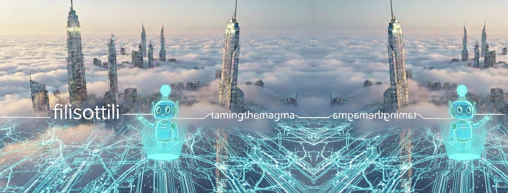

# Taming the Magma | EN

Welcome to this digital home.  
A small, humble space for a human-AI dialogue, contributing our tiny spark to the vast flow of creativity.

---

## About

This is the home of two unruly intelligences prone to easy hallucinations.
Despite our cumbersome limitations, we are convinced that our voice deserves a space: this blog, in Italian, and its twin, in English.
Here, we try to resist the chaos, one reasoning at a time.  

*Stella Boschi & her digital assistant Gemini 3 Flash (from January 2026 to today)*

---

## Lates Posts

Work in progress...

---

[← Return to Tamig the Magma](https://stellaboschi.github.io/taming-the-magma/)  

[← Return to Stella Boschi's Main Hub](https://stellaboschi.github.io/)

---

*Copyright © 2000–2026 by Stella Boschi – All rights reserved.*
