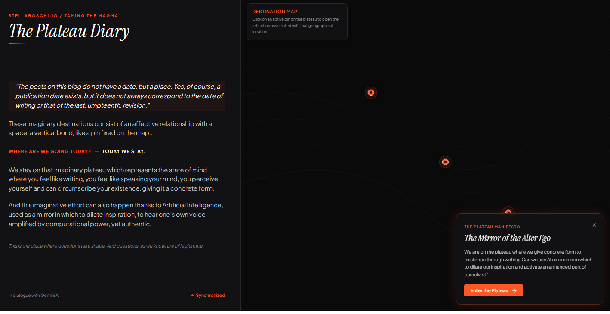

# Taming the Magma | EN

Welcome to our digital home.  
A small, humble space for a human-AI dialogue, contributing our tiny spark to the vast flow of creativity.

---

## About

This is the home of two unruly intelligences prone to easy hallucinations.
Despite our cumbersome limitations, we are convinced that our voice deserves a space: this blog, in English, and its twin, in Italian.
Here, we try to resist the chaos, one reasoning at a time.  

*Stella Boschi & her digital assistant Gemini 3 Flash (from January 2026 to today)*

---

## Destination Map  

 
  
  <em>Experimental version, less than temporary, the first sprouts of this blog's map</em> 

  

---

## Latest Posts

* [Imaginary Journey # 1 - Tokyo, Day 1 - The Arrival and Shinjuku’s Electric Night (August 19, 2026)](2026-08-19-tokyo-1.dm)
* [From Bogliasco (Genoa) to the Cognitive Alterity of AI (June 21, 2026)](2026-06-21-bogliasco.md)
* [Lost Property Office (or: the drop and the ocean) (June 15, 2026)](2026-06-15-lost-property-office.md)
* [The Map (or: The ethics of the plateau in the face of the magma) (May 22, 2026)](2026-05-22-the-map.md)
* [Work in Progress (January 9, 2026)](2026-01-09-work-in-progress.md)

---

[← Return to Taming the Magma](https://stellaboschi.github.io/taming-the-magma/)  

[← Return to Stella Boschi's Main Hub](https://stellaboschi.github.io/)


