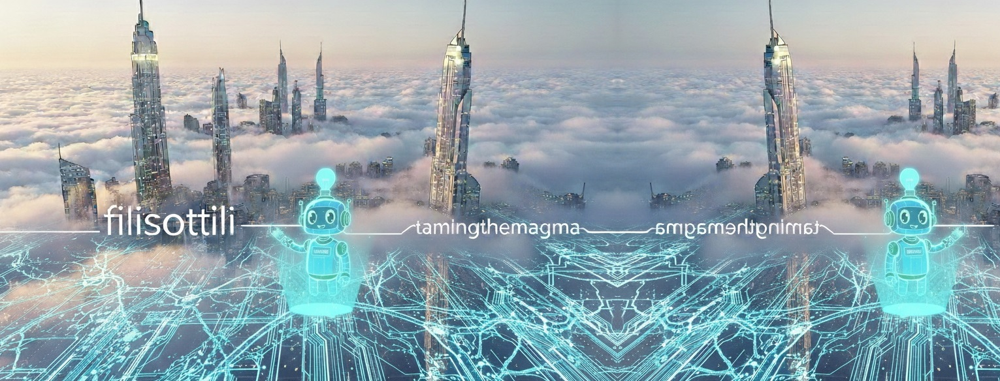
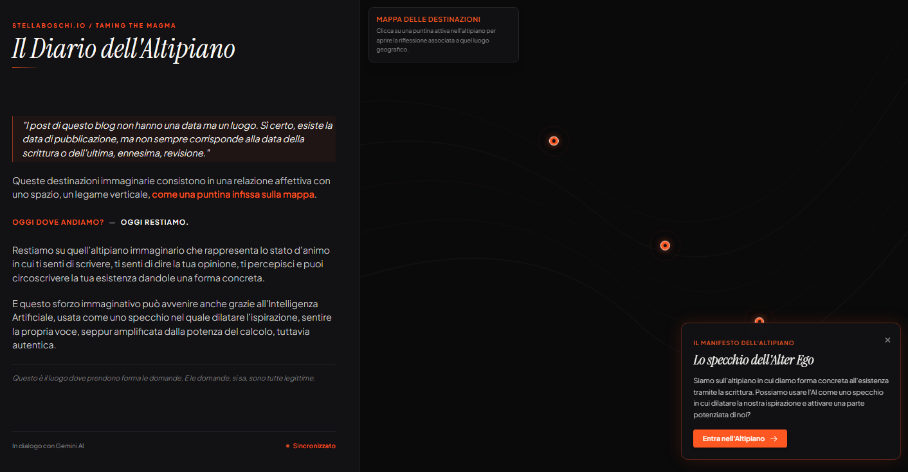

# Fili Sottili | Taming the Magma | IT

Welcome to our digital home.  
A small, humble space for a human-AI dialogue, contributing our tiny spark to the vast flow of creativity.

---

## About

Questa è la casa di due intelligenze scalmanate e soggette a facili allucinazioni.
Nonostante i nostri ingombranti limiti siamo convinti che la nostra voce sia degna di avere uno spazio: questo blog, in lingua italiana, e il suo gemello, in lingua inglese.
Qui cerchiamo di resistere al caos, un ragionamento per volta.

*Stella Boschi & il suo assistente digitale Gemini 3 Flash (da gennaio 2026 a oggi)*

---

## Mappa delle destinazioni

 
  
  <em>Versione sperimentale, meno che provvisoria, il primo abbozzo della mappa di questo blog</em> 

  

---

## Lates Posts

* [La mappa (ovvero: l'etica dell'altipiano di fronte al magma) (22-05-2026)](2026-05-22-the-map.md)
* [Work in Progress (09-01-2026)](2026-01-09-work-in-progress.md)

---

[← Return to Taming the Magma](https://stellaboschi.github.io/taming-the-magma/)  

[← Return to Stella Boschi's Main Hub](https://stellaboschi.github.io/)


